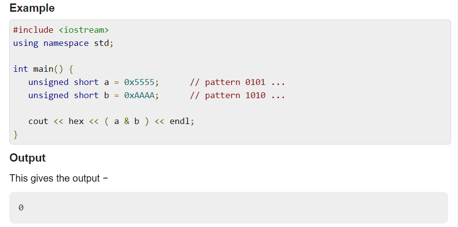
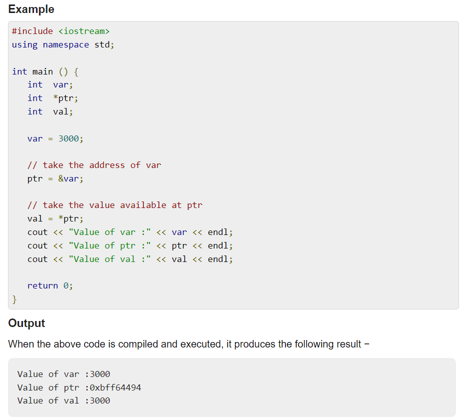
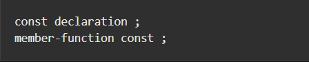
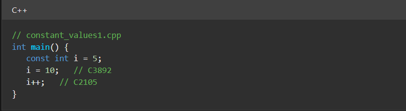
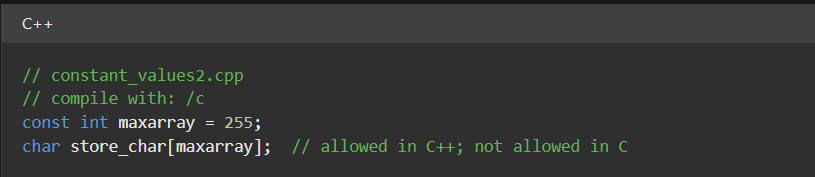
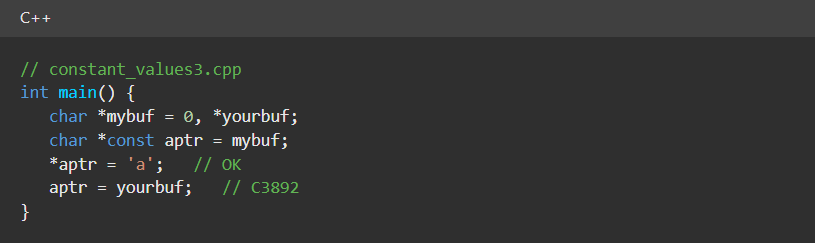
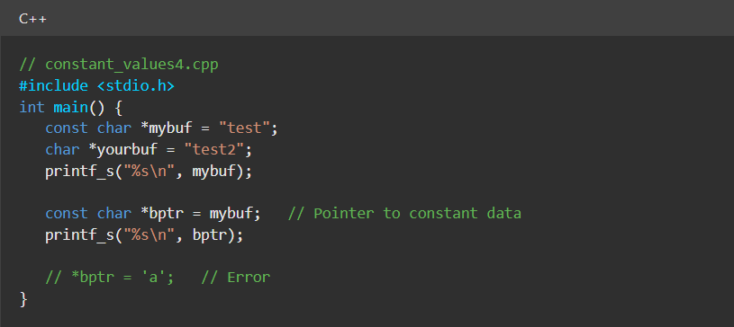
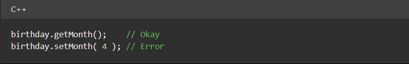

First: "&" Operator 

-The "&" symbol is used as an operator in C++.\
-It is used in 2 different places, one as a bitwise and operator and one as a pointer address of operator.

**_1-Bitwise AND: _**

The bitwise AND operator (&) compares each bit of the first operand to that bit of the second operand.
If both bits are 1, the bit is set to 1. Otherwise, the bit is set to 0.\
Both operands to the bitwise AND operator must be of integral types.

**_2-Address Of operator: _**

C++ provides two-pointer operators, which are Address of Operator (&) and Indirection Operator (*).\
A pointer is a variable that contains the address of another variable or you can say that a variable that contains the address of another variable is said to "point to" the other variable. A variable can be any data type including an object, structure or again pointer itself.\
The address of Operator (&), and it is the complement of *. It is a unary operator that returns the address of the variable(r-value) specified by its operand.

Second: "const" Keyword 

-the _**const**_ keyword specifies that the object or variable is not modifiable.

**_Syntax:_**\

The **_const_** keyword specifies that a variable's value is constant and tells the compiler to prevent the programmer from modifying it.

In C++, you can use the **_const_** keyword instead of the #define preprocessor directive to define constant values. Values defined with const are subject to type checking, and can be used in place of constant expressions.\
In C++, you can specify the size of an array with a **_const_** variable as follows:

In C++, constant values default to internal linkage, which allows them to appear in header files.\
The **_const_** keyword can also be used in pointer declarations.

A pointer to a variable declared as **_const_** can be assigned only to a pointer that is also declared as **_const_**.

You can use pointers to constant data as function parameters to prevent the function from modifying a parameter passed through a pointer.

For objects that are declared as **_const_**, you can only call constant member functions. This ensures that the constant object is never modified.

You can call either constant or nonconstant member functions for a nonconstant object. You can also overload a member function using the const keyword; this allows a different version of the function to be called for constant and nonconstant objects.

You cannot declare constructors or destructors with the **_const_** keyword.